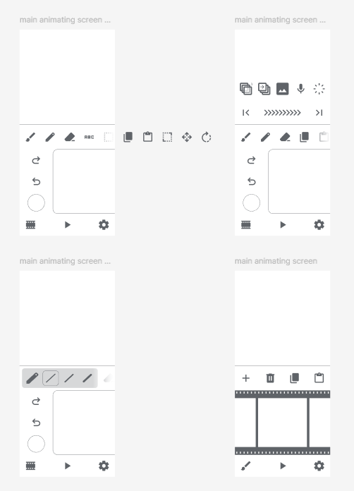

# flipbook
frontend for animation app flipbook featuring limited toolset imposing consistent creative decisions across all projects

## git flow
develop in a feature branch, merge to release X.Y when it works, merge to main when release X.Y is complete
 
<code>feature/feature-name</code> -> <code>release/X.Y</code> -> <code>main</code>

## design
here is a screenshot of a figma mockup showing some of the features planned for the app

## planned features for release 0.1
an animation window with a constant aspect ratio of 1:1
  
top row of buttons, designated for tools which impact actions in the animation window, left-aligned and allowed to overflow off the righthand side of the screen
  
a touchpad-and-button controller which will later be used to manipulate a cursor in the animation window to perform actions
  
bottom row of buttons, designated for actions which do not directly impact the animation's contents, center-aligned with items spaced between
  
for <code>release/0.1</code>, the buttons don't need to do anything, the focus is on getting the general layout of the primary editing screen setup
